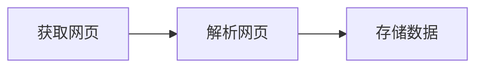

# Python网络爬虫笔记
> 这个笔记主要是阅读《Python网络爬虫从入门到实践》这本书所做的笔记，为了更好地学习这本书的内容，所以有了这个笔记。
## 网络爬虫入门
### 为什么要学网络爬虫
在过去，人们为了获取对手产品的特点，手工复制粘贴电商网站的信息到Excel表格中。记得考研名师张雪峰老师创业初期，为了获得各个高校的招生信息，手工复制了各个招生网站的信息下来，而这事情看似容易，他让助手做也难以完成。
而现在有了爬虫这一工具，可以把每条信息都抓取并处理以及存储，大大节省了人力。并且在各个领域都有积极作用，比如客服领域通过爬虫爬到的数据，对于不同问题进行分类，然后分配给不同的客服。
本书作者认为无论是否是技术人员都应该学习爬虫，由于学习成本并不高，简单就能实现基本功能。
### 网络爬虫是否合法
爬虫目前还属于拓荒阶段，互联网世界自己建立了Robots协议，但是法律层面还属于模糊阶段，可能犯法，可能不犯法。
```
User-agent:  Baiduspider
Allow:  /article
Allow:  /oshtml
Disallow:  /product/
Disallow:  /

User-Agent:  Googlebot
Allow:  /article
Allow:  /oshtml
Allow:  /product
Allow:  /spu
Allow:  /dianpu
Allow:  /oversea
Allow:  /list
Disallow:  /
```
以上是来自`https://www.taobao.com/robots.txt`的Robots协议，上面规定了可以爬取和不能爬取的内容，由于对于/product的内容许可不同，所以google可以访问到淘宝的商品页面
### 网络爬虫的基本议题
爬虫的基本流程

技术实现

流程 | 基础技术
---- | ----
获取网页 | request、urllib和selenium
解析网页 | re正则表达式、BeautifulSoup和lxml
存储数据 | 存入存储介质、读取存储介质
## 网络爬虫入门
### 搭建Python平台
本次安装使用Anaconda进行Python环境的搭建
**好处**：
- 像安装普通软件那样安装Python环境变量、解释器、开发环境
- 提供众多的各领域科学计算的包，如Numpy、Scipy、Scikit-Learn和BioPython等

**注意**：
- 在安装过程中选择添加PATH环境变量的选项

**工具**
- 使用BeautifulSoup4进行网络数据的爬取，在PowerShell下输入`pip install bs4`进行安装
- 使用Jupyter进行编程，在交互式变成和展示功能十分强大。

**Jupyter使用步骤**
1. 在PowerShell下输入jupyter notebook, 浏览器会启动Jupyter，地址为`http://localhost:8888/tree`
2. 单击右上角的New按钮，选中Python3进行编程
3. 键入print('hello world!'),得到`hello world!`结果

### Python使用入门
**基本命令**
```Python
# 在前面加上 # 表示注释
x = 1
if x == 1:
    print('Hello World!')
```
**数据类型**
```Python
# 列表
list1 = ['Python', 'Web', 'Scrappy']
list2 = [1, 2, 3, 4, 5]
list3 = ["a", 2, "c", 4]
print("list1[0]:", list1[0])
print("list2[1:3]:", list2[1:3])
```
```Python
#字典
namebook = {"Name":"Alex","Age":7,"Class":"First"} 
print(namebook["Name"])#可以把相应的键值放入方括号，提取值
print(namebook)#也可以直接输出整个字典
namebook = {"Name":"Alex","Age":7,"Class":"First"} 
print(namebook["Name"])#可以把相应的键值放入方括号，提取值
print(namebook)#也可以直接输出整个字典
```
**条件与循环**
```Python
book = "java"
if book == "python":
    print("You are studying python")
elif book == "java":
    print("You are studying java.")
else:
    print("Wrong.")
```
```Python
citylist = ["Beijing", "Shanghai", "Guangzhou"]
for eachcity in citylist:
    print(eachcity)
```
```Python
count = 0
while count < 3:
    print(count)
    count += 1 #与count = count + 1一样
```
**函数**
```Python
#定义函数
def fruit_function(fruit1, fruit2):
    fruits = fruit1 + " " + fruit2
    return fruits
#调用函数
result = fruit_function("apple", "banana")
print(result)`
```
**封装**
```Python
class Person: #创建类
    def __init__(self, name, age): #__init__()方法成为类的构造方法
        self.name = name
        self.age = age
        
    def detail(self):
        print(self.name)
        print(self.age)

obj = Person('santos', 18)
obj.detail()        

print(obj.name)
print(obj.age)
```

**集成**
```Python
class Animal:
    def eat(self):
        print("%s 吃" %self.name)
    def drink(self):
        print("%s 喝" %self.name)
    def shit(self):
        print("%s 吃" %self.name)
    def pee(self):
        print("%s 喝" %self.name)

class Cat(Animal):
    def __init__(self, name):
        self.name = name
    def cry(self):
        print('喵喵叫')
        
class Dog(Animal):
    def __init__(self, name):
        self.name = name
    def cry(self):
        print('汪汪叫')

c1 = Cat('小白家的小黑猫')
c1.eat()
c1.cry()

d1 = Dog('胖子家的萧瘦狗')
d1.eat()
```