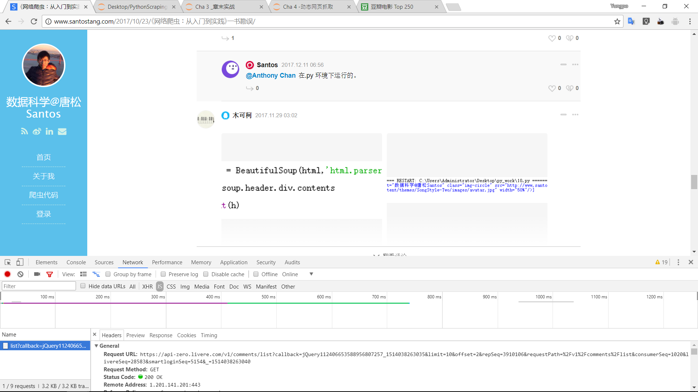

# 网页爬取要点
## 静态网页抓取
### 获取响应内容
```Python
#!/usr/bin/python
# coding: utf-8

import requests

link = "http://www.jmu.edu.cn/"
headers = {'User-Agent' : 'Mozilla/5.0 (Windows NT 10.0; Win64; x64) AppleWebKit/537.36 (KHTML, like Gecko) Chrome/63.0.3239.84 Safari/537.36'} 

r = requests.get(link, headers= headers)
print("文本编码:",r.encoding)
print("响应状态码:",r.status_code)
print("字节方式响应体:",r.content)
print("字符串方式的响应体:",r.text)
print("JSON解码器:",r.json)
```
```PowerShell
文本编码: ISO-8859-1
响应状态码: 200
字节方式响应体: b'<html>\r\n<head>\r\n<script language="javascript">setTimeout("location.replace(location.href.split(\\"#\\")[0])",1000);</script>\r\n</head>\r\n<iframe src="http://210.34.132.69:89/flashredir.html" frameborder=0></iframe>\r\n</html>\r\n\r\n'
字符串方式的响应体: <html>
<head>
<script language="javascript">setTimeout("location.replace(location.href.split(\"#\")[0])",1000);</script>
</head>
<iframe src="http://210.34.132.69:89/flashredir.html" frameborder=0></iframe>
</html>

JSON解码器: <bound method Response.json of <Response [200]>>
```

- 可以看到学校的文本编码格式和普通的UTF-8不大一样，估计会在字符集上面出问题。
爬取
- 响应码是200，代表成功
- 字节响应提内容上比较难以看懂。
- 字符串响应体的内容上，正常的网站会返回一个页面，而学校是返回内网的一个flashredir.html页面，这也是很大的问题。
- JSON解码器的来源可以看到

## 定时Requests
有些网页需要对Requests的参数进行设置才能访问，比如校园网如果不把headers设置为浏览器方式的话就不能访问。
### 传递URL参数
```Python
import requests
key_dict = {'key1': 'value1', 'key2': 'value2'}
r = requests.get('http://httpbin.org/get', params=key_dict)
print ("URL已经正确编码:", r.url)
print ("字符串方式的响应体: \n", r.text)
```
```PowerShell
URL已经正确编码: http://httpbin.org/get?key1=value1&key2=value2
字符串方式的响应体: 
 {
  "args": {
    "key1": "value1", 
    "key2": "value2"
  }, 
  "headers": {
    "Accept": "*/*", 
    "Accept-Encoding": "gzip, deflate", 
    "Connection": "close", 
    "Host": "httpbin.org", 
    "User-Agent": "python-requests/2.18.4"
  }, 
  "origin": "110.34.180.19", 
  "url": "http://httpbin.org/get?key1=value1&key2=value2"
}
```
- 可以看到在发送GET请求的时候通过params = key_dict更改内部参数可以获得对应url地址。
- 其中httpbin.org可以把请求内容响应出来。
## 发送POTST请求
```Python
import requests
key_dict = {'key1': 'value1', 'key2': 'value2'}
r = requests.post('http://httpbin.org/post', data=key_dict)
print (r.text)
```
```PowerShell
{
  "args": {}, 
  "data": "", 
  "files": {}, 
  "form": {
    "key1": "value1", 
    "key2": "value2"
  }, 
  "headers": {
    "Accept": "*/*", 
    "Accept-Encoding": "gzip, deflate", 
    "Connection": "close", 
    "Content-Length": "23", 
    "Content-Type": "application/x-www-form-urlencoded", 
    "Host": "httpbin.org", 
    "User-Agent": "python-requests/2.18.4"
  }, 
  "json": null, 
  "origin": "110.34.180.19", 
  "url": "http://httpbin.org/post"
}
```
可以看到post请求方式下通过data传递请求体内容
```Python
import requests
link = "http://www.santostang.com/" 
r = requests.get(link, timeout= 0.01)
```
为了避免无限等待，通过timeout设置超时时间，单位为秒

## TOP250电影数据抓取实战
### 网站分析
第一页url为`https://movie.douban.com/top250`
第二页url为`https://movie.douban.com/top250?start=25&filter=`
第三页url为`https://movie.douban.com/top250?start=50&filter=`
有理由推断爬取链接为`link = 'https://movie.douban.com/top250?start=' + str(i * 25)`
爬取内容为第i+1页数据
i在0~9之间
通过分析页面代码可以发现电影标题在`class_='hd'`的div内
可以用BeautifulSoup来解析单页标题数据所在div为为`soup.find_all('div', class_='hd')`
### 编码实战
```Python
import requests
from bs4 import BeautifulSoup

def get_movies():
    headers = {
    'user-agent': 'Mozilla/5.0 (Windows NT 6.1; Win64; x64) AppleWebKit/537.36 (KHTML, like Gecko) Chrome/52.0.2743.82 Safari/537.36',
    'Host': 'movie.douban.com'
    }
    movie_list = []
    for i in range(0,10):
        link = 'https://movie.douban.com/top250?start=' + str(i * 25)
        r = requests.get(link, headers=headers, timeout= 10)
        print (str(i+1),"页响应状态码:", r.status_code)
        
        soup = BeautifulSoup(r.text, "lxml")
        div_list = soup.find_all('div', class_='hd')
        for each in div_list:
            movie = each.a.span.text.strip()
            movie_list.append(movie)
    return movie_list
        
movies = get_movies()
print (movie_list)
```

## 动态网页抓取
### 异步更新技术AJAX
全称Asynchronous Javascript And XML,即异步Javascript和XML
> 通过在后台与服务器进行少量数据交换就可以是网页异步更新。

**好处**
- 在不重新加载整个网页的情况下对网页的某部分进行更新。
- 减少网页重复内容的狭窄。
- 节省了流量。

**坏处**
- 爬虫过程较为麻烦。

**判断依据**
点击某些功能按钮时，局部页面得到了更新，而url没有改变。
### 解析真实地址
1. 进入有AJAX的页面[《网络爬虫：从入门到实践》一书勘误](http://www.santostang.com/2017/10/23/%E3%80%8A%E7%BD%91%E7%BB%9C%E7%88%AC%E8%99%AB%EF%BC%9A%E4%BB%8E%E5%85%A5%E9%97%A8%E5%88%B0%E5%AE%9E%E8%B7%B5%E3%80%8B%E4%B8%80%E4%B9%A6%E5%8B%98%E8%AF%AF/)
2. 按F12进入浏览器的控制台，在Network选项下，点击‘查看更多’按钮，可以看到Network出现了AJAX链接的地址，点击后可以看到该链接的全部详情。

3. 通过获取的真是评论数据地址，获取内容。
```Python
import requests

link = "https://api-zero.livere.com/v1/comments/list?callback=jQuery1124049866736766120545_1506309304525&limit=10&offset=1&repSeq=3871836&requestPath=%2Fv1%2Fcomments%2Flist&consumerSeq=1020&livereSeq=28583&smartloginSeq=5154&_=1506309304527"
headers = {'User-Agent' : 'Mozilla/5.0 (Windows; U; Windows NT 6.1; en-US; rv:1.9.1.6) Gecko/20091201 Firefox/3.5.6'} 

r = requests.get(link, headers= headers)
print (r.text)
```
```PowerShell
/**/ typeof jQuery1124049866736766120545_1506309304525 === 'function' && jQuery1124049866736766120545_1506309304525({"results":{"parents":[{"replySeq":33251672,"name":"苏教授","memberId":"941B9A341D39A811D5153B3DC6E0C4CD","memberIcon":"http://q.qlogo.cn/qqapp/101256433/941B9A341D39A811D5153B3DC6E0C4CD/100","memberUrl":"https://qq.com/","memberDomain":"qq","good":0,"bad":0,"police":0,"parentSeq":33251672,"directSeq":0,"shortUrl":null,"title":"Hello world! - 数据科学@唐松Santos","site":"http://www.santostang.c
...
"file3":null,"additionalSeq":0,"content":"书里错误很多，留个qq吧","quotationSeq":null,"quotationContent":null,"consumerSeq":1020,"livereSeq":28583,"repSeq":3871836,"memberGroupSeq":26659841,"memberSeq":27140530,"status":0,"repGroupSeq":0,"adminSeq":25413747,"deleteReason":null,"sticker":0,"version":null}],"quotations":[]},"resultCode":200,"resultMessage":"Okay, livere"});
```
可以看到评论内容在json数据中的results.parents.content中
4. 获取到json数据后就直接解析了，用json的库可以解析相关内容。为了能抓到其他页面的数据，观察url的特点。
`https://api-zero.livere.com/v1/comments/list?callback=jQuery1124049866736766120545_1506309304525&limit=10&offset=1&repSeq=3871836&requestPath=%2Fv1%2Fcomments%2Flist&consumerSeq=1020&livereSeq=28583&smartloginSeq=5154&_=1506309304527`
可以看出起到分页作用的就两个数据，一个limit和一个offset，其中limit为页面容量，offset为偏移量，通过控制偏移量来控制分页数据。
```Python
import requests
import json

def single_page_comment(link):
    headers = {'User-Agent' : 'Mozilla/5.0 (Windows; U; Windows NT 6.1; en-US; rv:1.9.1.6) Gecko/20091201 Firefox/3.5.6'} 
    r = requests.get(link, headers= headers)
    # 获取 json 的 string
    json_string = r.text
    json_string = json_string[json_string.find('{'):-2]
    json_data = json.loads(json_string)
    comment_list = json_data['results']['parents']
    
    for eachone in comment_list:
        message = eachone['content']
        print (message)

for page in range(1,4):
    link1 = "https://api-zero.livere.com/v1/comments/list?callback=jQuery112407875296433383039_1506267778283&limit=10&offset="
    link2 = "&repSeq=3871836&requestPath=%2Fv1%2Fcomments%2Flist&consumerSeq=1020&livereSeq=28583&smartloginSeq=5154&_=1506267778285"
    page_str = str(page)
    link = link1 + page_str + link2
    print (link)
    single_page_comment(link)
```
```PowerShell

https://api-zero.livere.com/v1/comments/list?callback=jQuery112407875296433383039_1506267778283&limit=10&offset=1&repSeq=3871836&requestPath=%2Fv1%2Fcomments%2Flist&consumerSeq=1020&livereSeq=28583&smartloginSeq=5154&_=1506267778285
为何静态网页抓取不了？
奇怪了，我按照书上的方法来操作，XHR也是空的啊
XHR没有显示任何东西啊。奇怪。
找到原因了
...
明加载出来了
为什么刷新没有XHR数据，评论明明加载出来了
https://api-zero.livere.com/v1/comments/list?callback=jQuery112407875296433383039_1506267778283&limit=10&offset=2&repSeq=3871836&requestPath=%2Fv1%2Fcomments%2Flist&consumerSeq=1020&livereSeq=28583&smartloginSeq=5154&_=1506267778285
第19条测试评论
第18条测试评论
```
