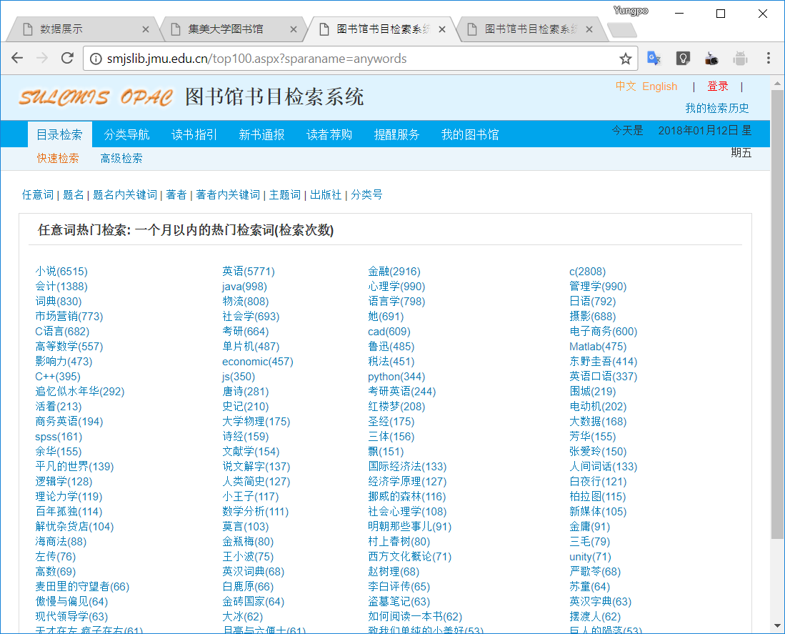
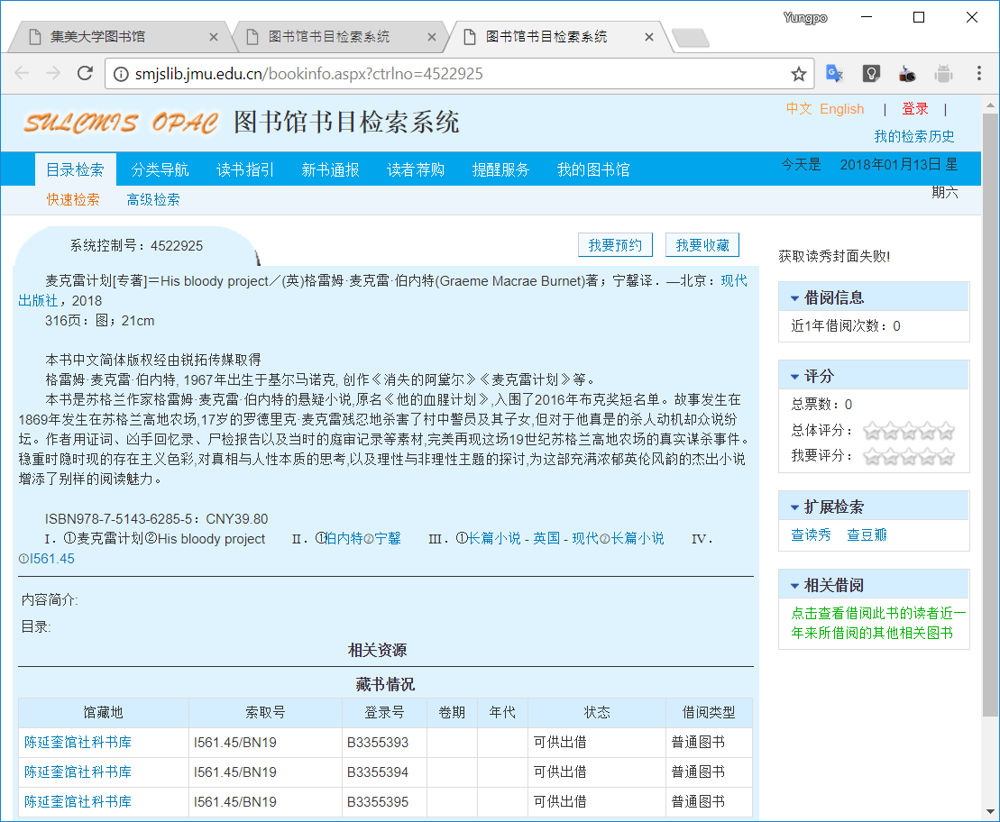
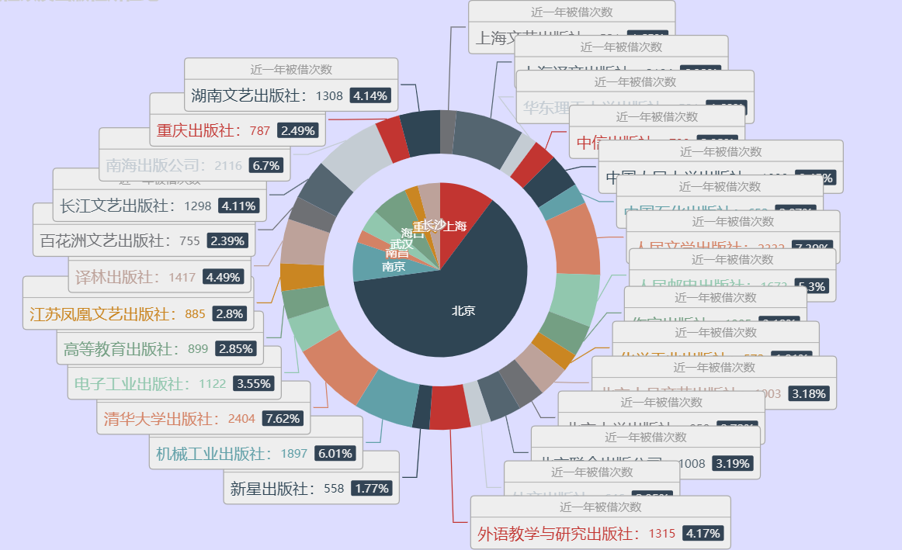

# 1. 项目综述

## 1.1. 项目来源和意义
书籍是人进步的阶梯，为此我们决定对这个阶梯做一个分析，能够直观看出对人们有影响力的书籍相关信息。通过去网上爬取书籍相关信息来进行可视化分析，从而能够对书籍的有关因素做一个了解。

## 1.2. 预期目标
通过技术手段获取相关的图书信息，然后可视化分析，使得对人们对于书籍的偏好因素有一个了解。

## 1.3. 解决问题
1. 图书馆热搜关键词搜索到的结果爬取。
2. 对图书馆爬取的数据进行可视化分析。

## 1.4. 面对的问题
图书馆书籍信息是静态信息，较为难以获取，需要观察特征来获取，并对信息不全的书籍进行排除。

# 2. 需求分析

## 2.1. 用户需求
通过网页对于图书馆的热门书籍的特征可以直观看出相应的特点。

## 2.2. 总体方案
将信息解析，处理出有效信息，存储到数据库。其中涉及到如何爬取书籍信息，如何进行分页的爬取。

## 2.3. 爬取过程的解析流程


# 3. 代码编写

## 3.1. 图书馆热词搜索信息爬取
本代码为图书馆热词搜索结果的信息爬取，其中涉及到了热搜关键词页面关键词所搜结果链接的爬取，关键词搜索结果分页链接爬取，书籍信息的爬取。

### 3.1.1. 热搜关键词页面关键词所搜结果链接的爬取

如图3-1-1所示，一个月以内的热门检索词的链接就是我们抓取的内容，用于访问下一级的所有结果
在Scrapy的项目目录下，建立资源爬虫类BooksSpider
并定义start_urls属性和parse函数
```python
class BooksSpider(scrapy.Spider):
    name = 'books'
    allowed_domains = ['smjslib.jmu.edu.cn']

    #定义要爬取的网址入口
    start_urls = ['http://smjslib.jmu.edu.cn/top100.aspx?sparaname=anywords']

    #将这100个搜索热词的搜索结果进行爬取
    def parse(self, response):
        for href in response.css('td a::attr(href)'):
            #用paese_books_pages解析搜索结果的分页
            yield response.follow(href, parse_books_pages)
```
其中
`td a::attr(href)`是根据浏览器的自带工具获取的css定位，能定位到所有的热门检索关键词
·start_urls = ['http://smjslib.jmu.edu.cn/top100.aspx?sparaname=anywords']·
用于定义要爬取的网址入口
·yield response.follow(href, parse_books_pages)·
用于解析搜索结果的分页

### 3.1.2. 关键词搜索结果分页链接爬取

如图3-1-2所示，我们要爬取的是总页数，需要定义一个parse_books_pages来获取每一页的链接，并进行解析内容。
```python
#获取该热词的搜索结果总页数，进行该热词每一页的爬取
def parse_books_pages(response):
    pages = len(response.css('#ctl00_ContentPlaceHolder1_gotoddlfl1 > option'))
    anywords = response.xpath('//*[@id="ctl00_ContentPlaceHolder1_conditionlbl"]/font/text()').extract()[0]
    body = {'anywords': anywords,
            'dt': 'ALL',
            'cl': 'ALL',
            'dp': '20',
            'sf': 'M_PUB_YEAR',
            'ob': 'DESC',
            'sm': 'table',
            'dept': 'ALL'}

    for page in range(1, pages + 1):
        body['page'] = page
        url = 'http://smjslib.jmu.edu.cn/searchresult.aspx?{}'.format(urlencode(body, encoding='gb2312'))
        yield scrapy.Request(url, parse_books_url)
```
其中，通过浏览器的内置工具，可以找到总页数的css是`'#ctl00_ContentPlaceHolder1_gotoddlfl1 > option'`,这样可以得知总页数为`pages = len(response.css('#ctl00_ContentPlaceHolder1_gotoddlfl1 > option'))`
同理获得检索的关键词` anywords = response.xpath('//*[@id="ctl00_ContentPlaceHolder1_conditionlbl"]/font/text()').extract()[0]`
有了检索的关键词`anywords`和总页数`pages`就能构造出每一页的链接，并进行请求和解析，以爬取下一级内同。

### 3.1.3. 每页书籍信链接的息获取
通过构造每页的链接来对改链接下书籍信息的链接进行爬取，并进行解析。
需要构造一个`parse_books_url`函数来对书籍的链接进行获取。
```python
#将该页中的书本信息进行爬取解析
def parse_books_url(response):
    for href in response.css('td span.title a::attr(href)'):
        yield response.follow(href, parse_books_imformation)
```
`'td span.title a::attr(href)'`是通过浏览器工具获取的css坐标下，获取的链接，通过`yield response.follow(href, parse_books_imformation)`对书籍页面进行解析。

### 3.1.4. 书籍信息的获取

如图3-1-4所示，可以看到很多书籍的关键信息，有标题信息，作者信息，出版信息等。
这样可以定义一个`parse_books_imformation`函数进行对图书信息的解析获取。
```python
#爬取解析每一页的关键信息
def parse_books_imformation(response):

    book_info = response.css('#ctl00_ContentPlaceHolder1_bookcardinfolbl').xpath('string(.)').extract()[0].split(
        '\u3000')
    book_info = list(filter(lambda item: item, book_info))

    title_author_publishment = re.split('／|．—', book_info[0])
    #标题
    title = title_author_publishment[0]
    #作者
    author = title_author_publishment[1]
    publishment = title_author_publishment[-1].split('；')[0]
    #出版城市
    publisher_city, publisher, publish_year = re.split('：|，', publishment)
    #出版年份
    publish_year = re.search(r'\d{4}', publish_year).group()

    pages_length = re.split('；', book_info[1])
    pages = re.findall('\d\d+', pages_length[0])
    #总页数
    pages = max(pages)
    #书籍长度
    length = re.search('\d\d+', pages_length[1]).group()

    isbnandprice = str(book_info[-5])
    #isbn码
    isbn = isbnandprice.split('：')[0]
    isbn = re.search(r'ISBN[\w|-]+', isbn).group()

    #价格
    price = isbnandprice.split('：')[1]
    price = re.search(r'\d+.?\d+', price).group()

    #相关标题
    titles = str(book_info[-4]).split('．')[-1]
    titles = re.split(r'[①-⑳]', titles)
    titles.remove('')

    #相关作者
    authors = str(book_info[-3]).split('．')[-1]
    authors = re.split(r'[①-⑳]', authors)
    authors = list(map(lambda author: author.strip(','), authors))
    authors = list(filter(lambda author: author, authors))

    #相关标签
    tags = str(book_info[-2]).split('．')[-1]
    tags = re.split(r'[①-⑳]', tags)
    tags.remove('')
    tags = list(map(lambda taglist: re.split('  - |-', taglist), tags))
    tags = sum(tags, [])
    tags = list(set(tags))

    #索引码
    association = response.xpath('//*[@id="bardiv"]/div/table/tbody/tr[1]/td[2]/text()').extract()[0].split('/')[0]
    association = re.search(r'\w+[.\w+]+[-\w+]+', association).group()

    #馆藏量用馆藏链接数量表示
    total = len(response.xpath('//*[@id="bardiv"]/div/table/tbody/tr[*]/td[1]/a'))
    #借出量用借出链接数量表示
    loan = len(response.xpath('//*[@id="bardiv"]/div/table/tbody/tr[*]/td[6]/a'))
    #近一年的借出数量
    frequence = response.xpath('//*[@id="ctl00_ContentPlaceHolder1_blclbl"]/text()').extract()[0]
    item = SmjslibItem()
    if isbn and price and association:
        item['title'] = title
        item['author'] = author
        item['publisher_city'] = publisher_city
        item['publisher'] = publisher
        item['publish_year'] = publish_year
        item['pages'] = pages
        item['length'] = length
        item['isbn'] = isbn
        item['price'] = price
        item['titles'] = titles
        item['authors'] = authors
        item['tags'] = tags
        item['association'] = association
        item['total'] = total
        item['available'] = total - loan
        item['loan'] = loan
        item['frequence'] = frequence
        yield item
```
可以通过浏览器的工具获知，在css标签`'#ctl00_ContentPlaceHolder1_bookcardinfolbl')`下有很多信息，比如标题信息，作者信息，出版信息，书籍规格等，通过`split`,`match`,`search`等正则表达式和字符串有关的数据可以解析出需要的信息。
馆藏量可以通过馆藏链接的数量获取
```python
    total = len(response.xpath('//*[@id="bardiv"]/div/table/tbody/tr[*]/td[1]/a'))
```
借出量可以通过借出链接来获取
```python
loan = len(response.xpath('//*[@id="bardiv"]/div/table/tbody/tr[*]/td[6]/a'))
```
通过简单运算就能计算出可借量
```python
item['available'] = total - loan
```
### 3.1.5. 爬取的信息
以下是一条爬取信息的例子
```json
{ 
    "title": "英语口语教程·1，英语初级口语＝Oral workshop:reproduction", 
    "author": "吴祯福主编；李又文等编写", 
    "publisher_city": "北京", 
    "publisher": "外语教学与研究出版社", 
    "publish_year": "1993", 
    "pages": "310", 
    "length": "20", 
    "isbn": "ISBN7-5600-0818-6", 
    "price": "13.80", 
    "titles": [ 
        "英语口语教程", 
        "Oral workshop:reproduction", 
        "英语初级口语", 
        "英语 口语"
    ], 
    "authors": [ 
        "吴祯福", 
        "李又文"
    ], 
    "tags": [ 
        "教材", 
        "英语", 
        "口语"
    ], 
    "association": "H319.9", 
    "total": 7, 
    "available": 7, 
    "loan": 0, 
    "frequence": "0"
}
```
# 4. 程序调试
通过爬取地数据获得近一年来被借阅次数超过500次地所属出版社及其所在地

通过图4可以很直观地热门借阅的书籍所属的城市主要来源于北京、上海、南京，如果说书籍是人类进步的阶梯，那么北京、上海、南京可以说是推进人类进步的文化要地。