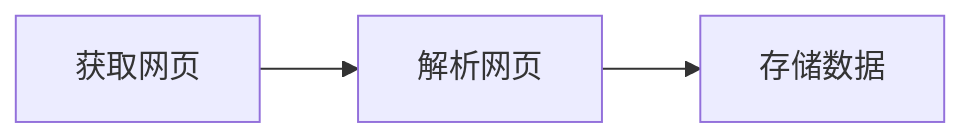

# Python网络爬虫笔记
> 这个笔记主要是阅读《Python网络爬虫从入门到实践》这本书所做的笔记，为了更好地学习这本书的内容，所以有了这个笔记。
## 网络爬虫入门
### 为什么要学网络爬虫
在过去，人们为了获取对手产品的特点，手工复制粘贴电商网站的信息到Excel表格中。记得考研名师张雪峰老师创业初期，为了获得各个高校的招生信息，手工复制了各个招生网站的信息下来，而这事情看似容易，他让助手做也难以完成。
而现在有了爬虫这一工具，可以把每条信息都抓取并处理以及存储，大大节省了人力。并且在各个领域都有积极作用，比如客服领域通过爬虫爬到的数据，对于不同问题进行分类，然后分配给不同的客服。
本书作者认为无论是否是技术人员都应该学习爬虫，由于学习成本并不高，简单就能实现基本功能。
### 网络爬虫是否合法
爬虫目前还属于拓荒阶段，互联网世界自己建立了Robots协议，但是法律层面还属于模糊阶段，可能犯法，可能不犯法。
```
User-agent:  Baiduspider
Allow:  /article
Allow:  /oshtml
Disallow:  /product/
Disallow:  /

User-Agent:  Googlebot
Allow:  /article
Allow:  /oshtml
Allow:  /product
Allow:  /spu
Allow:  /dianpu
Allow:  /oversea
Allow:  /list
Disallow:  /
```
以上是来自`https://www.taobao.com/robots.txt`的Robots协议，上面规定了可以爬取和不能爬取的内容，由于对于/product的内容许可不同，所以google可以访问到淘宝的商品页面
### 网络爬虫的基本议题
爬虫的基本流程

技术实现

流程 | 基础技术
---- | ----
获取网页 | request、urllib和selenium
解析网页 | re正则表达式、BeautifulSoup和lxml
存储数据 | 存入存储介质、读取存储介质
