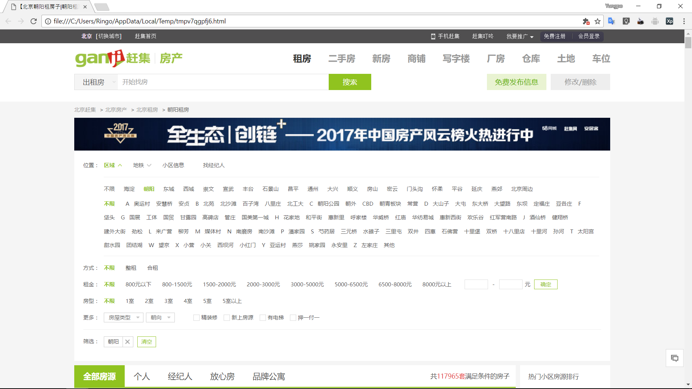
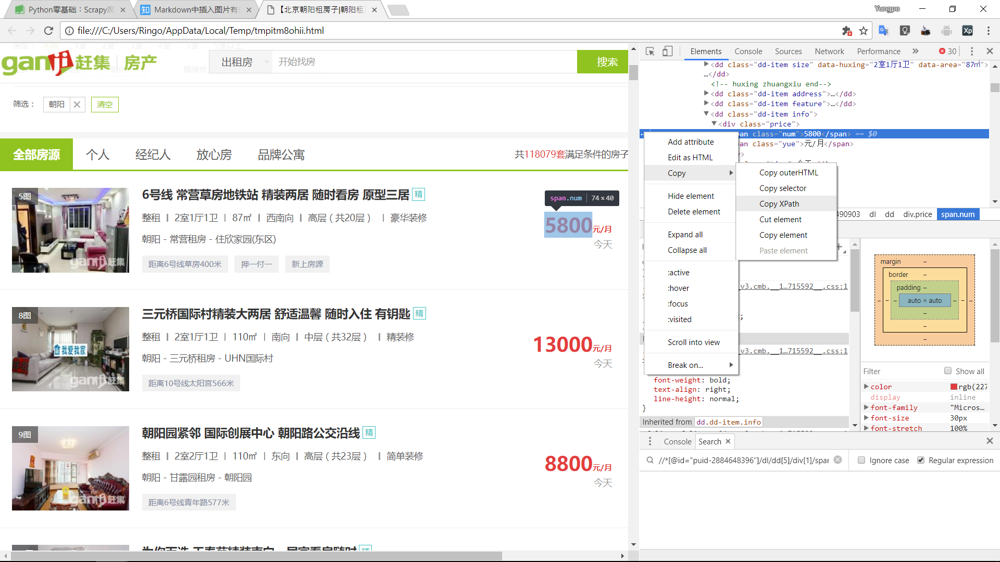
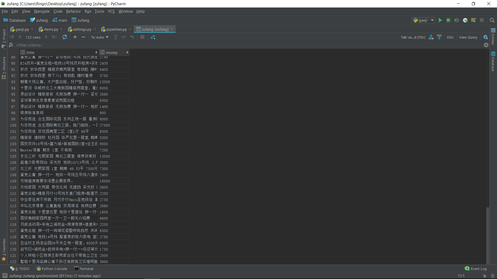

# scrapy学习笔记
## 学习环境
类别 | 环境
----- | ------
系统 | Windows 10 64bit
Shell | PowerShell
## 环境安装
### Python安装
1. 到官网的[下载链接](https://www.python.org/ftp/python/3.5.3/python-3.5.3-amd64.exe)下载python3.5.3进行python的安装，**勾选Add Python3.5 to PATH**，避免手动添加，然后一路下一步。
2. 在PowerShell中输入python获取版本号无误即安装成功。
```PowerShell
PS C:\Users\Ringo> python
Python 3.5.3 (v3.5.3:1880cb95a742, Jan 16 2017, 16:02:32) [MSC v.1900 64 bit (AMD64)] on win32
Type "help", "copyright", "credits" or "license" for more information.
```
### Scrapy安装
1. 在windows下安装Scrapy前必须要安装[pywin32](https://nchc.dl.sourceforge.net/project/pywin32/pywin32/Build%20220/pywin32-220.win-amd64-py3.5.exe)。
2. 下载[Lxml](https://download.lfd.uci.edu/pythonlibs/yjwkc9i2/lxml-4.1.1-cp35-cp35m-win_amd64.whl)，并在相应目录下在PowerShell输入pip install .\lxml-4.1.1-cp35-cp35m-win_amd64.whl
3. 输入pip install Scrapy安装Scrapy。

## 初探Scrapy爬虫数据抓取

### Scrapy命令式交互模式
本次现在命令行下面进行对于数据的抓取
抓取的目标网站是[赶集网]

#### 获得任一个价格的xpath
(http://bj.ganji.com/fang1/chaoyang/)
在PowerShell下输入

```PowerShell
scrapy shell http://bj.ganji.com/fang1/chaoyang/
```

打开链接获取变量的数据保存的变量是一个response
通过response查看获取数据为200以及相应的地址

```Python
>>> response
<200 http://bj.ganji.com/fang1/chaoyang/>
```

通过view(response)查看获取的地址


按F12进入控制台获取价格的xpath

获得xpath为
> //*[@id="puid-2892490903"]/dl/dd[5]/div[1]/span[1]


通过以下两个语句获取相应的标签以及文本
```Python
>>> response.xpath('//*[@id="puid-2892490903"]/dl/dd[5]/div[1]/span[1]').extract()
['<span class="num">5800</span>']
>>> response.xpath('//*[@id="puid-2892490903"]/dl/dd[5]/div[1]/span[1]/text()').extract()
['5800']
```

**验证成功**

#### 抓取所有价格的xpath
通过修改单个价格xpath获取所有的价格文本
其中单个价格的xpath为
> //*[@id="puid-2892490903"]/dl/dd[5]/div[1]/span[1]/text()

将其修改为
> //div[@class="f-list-item ershoufang-list"]/dl/dd
[5]/div[1]/span[1]/text()

由于每个租房信息的标签为div
其中且通过id查找仅能查找到单个租房信息，所以通过class进行查找。

```Python
>>> response.xpath('//div[@class="f-list-item ershoufang-list"]/dl/dd[5]/div[1]/span[1]/text()').extract()
['5800', '13000', '8800', '4800', '22000', '7200', '7000', '12000', '6000', '7000', '11000', '5500', '5700', '6000', '63
00'
...
', '9000', '4900', '2950', '1300', '2550',
 '1750', '2750', '2250', '3500', '900', '1900', '2300', '5500', '14000', '7500', '9000', '899', '4500', '4200', '9500',
'2200']
>>> len(response.xpath('//div[@class="f-list-item ershoufang-list"]/dl/dd[5]/div[1]/span[1]/text()').extract())
120
```

在命令行捕捉到了所有的价格信息，同理也可以捕捉到所有标题信息、地址信息、详情信息等
其中标题信息集合的xpath为
> //div[@class="f-list-item ershoufang-list"]/dl/dd[1]/a/text()

#### 命令交互模式函数介绍
request 对网址发起请求的请求信息
response 网址服务器响应请求,发回的相应信息
view(response) 调用系统自带浏览器,查看response中保存着从网址中获取的网页数据
fetch(url)在交互模式下,重新对一个url网址发送请求,自动更新到request和response中

### Scrapy爬虫数据抓取
#### 项目初始化
执行建项命令
```PowerShell
Scrapy startproject zufang
```
建立项目后用Pycharm打开项目看到目录结构

```
.
+-- zufang
|   +-- spiders        ---在该目录下定义爬虫类并集成scrapy.Spider
|       +-- __init__.py---只有一个
|   +-- __init__.py    ---保持默认，不需要做任何修改
|   +-- items.py       ---自定义项目类的地方，也就是爬虫获取到数据之后，传入管道文件（pipeline.py)的载体
|   +-- middlewares.py ---中间配置文件
|   +-- pipelines.py   ---项目管道文件，对传入的项目类中的数据进行一个清理和入库
|   +-- setting.py     ---Scrapy项目的设置文件，例如下载延迟，项目管道文件中类的启用以及自定义中间件的启用和顺序
+-- scrapy.cfg
```

在spiders目录下添加ganji.py爬虫文件

`ganji.py`
```Python
import scrapy

class GanjiSpider(scrapy.Spider):
    name = "zufang"
    start_urls = ['http://bj.ganji.com/fang1/chaoyang/']

    def parse(self, response):
        print(response)
        title_list = response.xpath('//div[@class="f-list-item ershoufang-list"]/dl/dd[1]/a/text()').extract()
        money_list = response.xpath('//div[@class="f-list-item ershoufang-list"]/dl/dd[5]/div[1]/span[1]/text()').extract()

        for i,j in zip(title_list, money_list):
            print(i,":",j)
```
运行
```PowerShell
scrapy crawl zufang
```

可以获得多个类似以下的组合
```PowerShell
凯德锦绣租售中心东四环豪华社区精装两居室出租 : 11000
为你而选 尚东阁精装开间随时看房入住集中供暖近地铁电梯房 : 3800
双桥地铁站东北方向 朝阳路周家井公交车站下车就到 金真子后面 : 2400
为你而选 风格派 1室0厅 51平 : 5600
...
月底活动周+来电立减现金+房源有限+无+我们是认真的 : 2700
无附加费 地铁6号线青年路站 精致装修 押一付一 : 1500
```

其中zip()函数以参数中最短长队数组为准。

### Scrapy爬虫数据入库
#### 初始化数据库
通过pip安装ipython
```Python
pip install ipython
```
安装后通过ipython进入ipython的命令行模式
```Python
In [1]: import sqlite3

In [2]: zufang = sqlite3.connect('zufang.sqlite')

In [3]: create_table = 'create table zufang (tittle varchar(512), money varchar(128))'

In [4]: zufang.execute(create_table)
Out[4]: <sqlite3.Cursor at 0x1cb596af730>

In [5]: exit
```

这样，数据库zufang就新建好了，并且新建了表名为zufang的表
#### 将爬到的数据通过pipline打印出来
启用setting.py中的管道功能
```Python
ITEM_PIPELINES = {
   'zufang.pipelines.ZufangPipeline': 300,
}
```
在items.py中定义ZufangItem类

```Python
import scrapy

class ZufangItem(scrapy.Item):
    # define the fields for your item here like:
    # name = scrapy.Field()
    tittle = scrapy.Field()
    money = scrapy.Field()
    # pass
```

在ganji.py文件中定义parse函数解析
```Python
import scrapy
from ..items import ZufangItem

class GanjiSpider(scrapy.Spider):
    name = "zufang"
    start_urls = ['http://bj.ganji.com/fang1/chaoyang/']

    def parse(self, response):
        print(response)
        zf = ZufangItem()
        title_list = response.xpath('//div[@class="f-list-item ershoufang-list"]/dl/dd[1]/a/text()').extract()
        money_list = response.xpath('//div[@class="f-list-item ershoufang-list"]/dl/dd[5]/div[1]/span[1]/text()').extract()
        for i,j in zip(title_list, money_list):
            zf['tittle'] = i
            zf['money'] = j
            yield zf
            # print(i,":",j)
```
在piplines.py文件中定义ZufangPipeline类以及其函数process_item
```Python
class ZufangPipeline(object):
    def process_item(self, item, spider):
        print(spider.name, 'piplines')
        return item
```
得到关键结果
```PowerShell
zufang piplines
2017-12-19 21:01:45 [scrapy.core.scraper] DEBUG: Scraped from <200 http://bj.ganji.com/fang1/chaoyang/>
{'money': '2000', 'tittle': '多睡半+5min到地铁口+不选贵的+你和惬意只差一个蛋壳'}
zufang piplines
2017-12-19 21:01:45 [scrapy.core.scraper] DEBUG: Scraped from <200 http://bj.ganji.com/fang1/chaoyang/>
{'money': '3600', 'tittle': '整租十里河品牌公寓不拆迁独厨独卫实墙明窗无'}
```
可以是看到pipline文件中的`print(spider.name, 'piplines')`语句得到。
#### 通过pipline将爬出来的数据存入sqlite
通过在pipline.py调用sqlite3实现数据存入数据库
```Python
import sqlite3

class ZufangPipeline(object):
    def open_spider(self, spider):
        self.con = sqlite3.connect("zufang.sqlite")
        self.cu = self.con.cursor()

    def process_item(self, item, spider):
        print(spider.name, 'piplines')
        insert_sql = "insert into zufang(tittle, money) values('{}','{}')".format(item['tittle'], item['money'])
        print(insert_sql)
        self.cu.execute(insert_sql)
        self.con.commit()
        return item

    def spider_close(self, spider):
        self.con.close()
```
执行`scrapy crawl zufang`
可以查看数据库内容

共122条数据被抓进了数据库里面